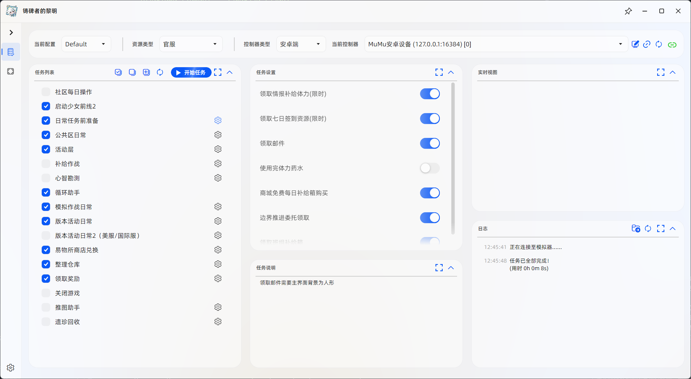
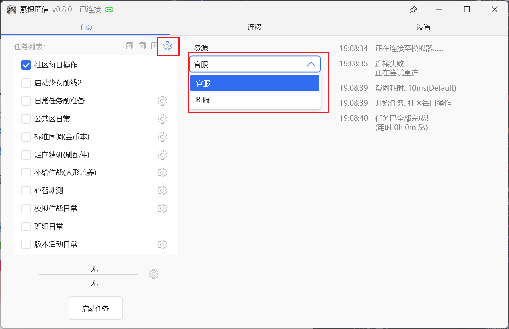

<!-- markdownlint-disable MD033 MD041 -->
<p align="center">

</p>

<div align="center">

# MaaGF2Exilium助手

</div>

本项目基于 [MaaFramework](https://github.com/MaaXYZ/MaaFramework) 所提供的项目模板进行开发的少女前线2：追放的自动化助手。

## 联系方式

如果有不懂的地方，抑或是想要添加的功能，或者你也想一起开发，甚至是划水聊天~~催更~~。

欢迎扫码加入**QQ交流群：644799227**。
<p align="center">

</p>

## 使用事项

> [!NOTE]  
> 大部分测试都是在 Windows 系统上测试的，因此其他操作系统若有运行问题，请提 Issues 或加群讨论。  
> 开发是基于 MuMu12 模拟器测试的，因此推荐使用 MuMu12 运行游戏。其他模拟器若出现问题，请第一时间把脚本根目录下`debug\maa.log` 文件保存并截图进行反馈。

0. 默认用户的操作系统为 Windows 系统。
1. 推荐使用MuMu模拟器12运行游戏，[模拟器支持情况](https://maa.plus/docs/zh-cn/manual/device/windows.html)请查看官方文档。
2. 模拟器建议设置为`16:9`的比例的分辨率，该比例典型的分辨率有`3840*2160 (4K)`、`2560*1440 (2K)`、`1920*1080 (1080P)`、`1280*720 (720P)`。
3. 每次在软件内更新后，在有新功能的添加的情况下可能不会刷新出来新功能选项，请关闭软件后，删除脚本程序根目录下 `config` 目录中的 `config.json` 文件后再次打开脚本程序即可。但需要重新配置一些选项内容。

## 使用方式

 0. 从 [Releases](https://github.com/DarkLingYun/MaaGF2Exilium/releases)下载压缩包名为 `MaaGF2ExiliumGUI-win-x86_64-v0.x.x.zip` 的GUI版本。
 1. 解压下载好的压缩包
 2. 双击或右键运行解压目录下的 `MaaGF2Exilium.exe` 文件即可 **(确保[MuMu模拟器](https://mumu.163.com/)已运行)**

<br>
 <p align="center">
  
  <br>
  <span>软件界面图</span>
</p>

## 功能说明

> [!NOTE]  
> 请用户仔细阅读功能说明并知晓使用事项，未描述的功能默认无注意事项。脚本全部功能请查阅文档下方内容。

### 社区每日操作

> [!NOTE]  
> 在使用该功能前, 请确定可以通过账号密码登录到[少女前线2: 追放社区](https://gf2-bbs.exiliumgf.com/)。

在确认可以登录到社区后，想要使用 `社区每日操作` 功能时，请在脚本程序根目录下 `config` 目录中创建一个名为 `secret.json` 的文件，并使用记事本程序等打开写入以下内容并保存：

```json
{
  "account_name": "手机号或邮箱",
  "passwd": "用户密码"
}
```

之后打开脚本程序勾选该功能即可。

#### 填写示范

手机号账号：

```json
{
  "account_name": "15311112222",
  "passwd": "123456789"
}
```

邮箱账号：

```json
{
  "account_name": "2760888888@qq.com",
  "passwd": "123456789"
}
```

### 个人主页批量使用兑换码

兑换码存放在Gitee仓库：[GuiLuan/GF2_RedeemCode](https://gitee.com/guiluan/GF2_RedeemCode)，你可以访问 [这个页面](https://gitee.com/guiluan/GF2_RedeemCode/blob/master/redeemCode.json) 来查看当前已有的兑换码。

>[!CAUTION]
>云端仓库的兑换码来自个人搜集和用户上传，不保证兑换码全部可用。
>
>截至2025/02/16，仓库内**无**可用兑换码。

在运行该任务时，脚本会在 `config/redeemCode.json` 中保存已经在本地使用过的兑换码，防止重复使用兑换码；也因此，当你更新资源时，建议不要删除该文件。

### 启动/关闭游戏

启动和关闭游戏由于不同渠道服实现的方式不同，需要手动设置对应服的资源后才可支持启动和关闭游戏功能。参考下图切换即可：

<p align="center">

</p>

### 日常任务前准备

日常任务前准备中包含拆解武器配件功能，支持选择拆解等级。除非手动设置了配件锁定规则，否则不建议选择选择 `精密级及以下未培养`。默认情况下该功能关闭，且默认拆解配件等级为`工业级及以下未培养`

### 易物所商店兑换

> [!NOTE]  
> 该功能目前部分商店仅兑换稀有道具，其他非稀有道具默认不支持兑换。后续会看能否实现自定义选择。

详细商店兑换内容如下

#### 班组商店

> [!NOTE]
> 只支持声望商店

1. 波波沙心智存档
2. 火控校准芯片

#### 调度商店

1. 访问许可
2. 心意礼盒
3. 存量条T2
4. 存量条T3
5. 存量条T4
6. 战场报告
7. 萨狄斯金
8. 解析图纸
9. 奇忆甄选·暗流
10. 奇忆甄选·火线  

#### 讯段交易(每周首领挑战)

1. 塞布丽娜心智存档
2. 访问许可
3. 基原信息核
4. 次世代内存条

### 班组日常

#### 尘烟前线

> [!WARNING]  
> 默认战斗类型是前哨战模式。用户可更改为攻坚战，但攻坚战当前的逻辑战斗的分数普遍不高，建议的用户请手动选择前哨战或关闭此功能并等待后续该功能升级。

目前的逻辑是选择整备室配置然后按照作战效能选择前四个人形，之后打开助选择从第一行的3个人形依次选择，直到成功入队。若助战第一行三个人形都已上场，则默认使用四个人形进行作战。

战斗结束后，当识别到战斗次数不足时，若发现有可领取的奖励时，会默认领取奖励。

## 常见问题

见[文档](docs/常见问题.md)
  
## 已有功能

* [x] 社区每日操作 *默认关闭*

* [x] 启动游戏

* [x] 个人主页自动使用兑换码(兑换码从云端拉取，不需要用户提供) *默认关闭*

* [x] 日常任务前准备
  * [x] 领取情报体力(限时)
  * [x] 领取七日签到资源(限时)
  * [x] 领取邮件
  * [x] 领取活动页情报补给体力
  * [x] 使用完体力药水
  * [x] 商城购买免费补给箱(包括每周和每日的的补给箱)
  * [x] 边界推进晶源采集派遣与领取

* [x] 公共区日常
  * [x] 访问休息室
  * [x] 调度室任务一键领取和再次派遣
  * [x] 领取调度收益的情报储备和资源生产
  * [x] 派遣收益领取

* [x] 活动层
  * [x] 美味烹调
  * [x] 茶歇一刻
  * [x] 领取逸趣导算进度奖励


* [x] 萨狄斯金_配件精调及心智螺旋

* [x] 定向精研
  * [x] 支持配件类型与配件效果选择
  * [x] 自动寻找最高可自律关卡(玩家需要确保每个配件类型下至少有一个可自律关卡)  

* [x] 补给作战
  * [x] 自动寻找最高可自律关卡(玩家需要确保至少有一个可自律关卡)  
  * [ ] 补给资源选择：
    * [x] 战争报告_人形升级
    * [x] 解析图纸_武器升级
    * [x] 增域存量条_提升人形等级上限

* [x] 心智勘测
  * [x] 材料选择
  * [x] 自动寻找最高可自律关卡

* [x] 模拟作战日常
  * [x] 常规首领挑战自律
    * [x] 支持自动自律
  * [x] 自动实兵演习
  * [x] 自动领取峰值推定-常规峰值奖励
  * [x] 自动进行 0 级极限峰值
  * [x] 全自动兵棋推演（拿满参与奖励后不再进行）

* [x] 班组日常
  * [x] 补给领取
  * [x] 要务自动战斗
  * [x] 尘烟前线自动作战
  * [x] 尘烟前线补给领取

* [x] 通用版本活动(大小型活动通用)
  * [x] 物资模式自律
  * [x] 物资商品兑换功能

* [x] 易物所商店集中兑换
  * [x] 班组商店
  * [x] 公共区调度商店
  * [x] 讯段交易(每周首领挑战)

* [x] 整理仓库
  * [x] 拆解武器(支持选择拆解类型)
  * [x] 拆解武器配件(支持选择拆解类型)
  * [x] 拆解生长数据(支持选择拆解类型)
  * [x] 开启物资助力箱

* [x] 领取奖励
  * [x] 委托奖励（每日订单、危途见证、征程丰碑）
  * [x] 巡录通行证奖励
    * [x] 沿途行动周期奖励(每日/每周任务奖励)
    * [x] 等级奖励领取
    * [x] 等级补给箱确认
  * [x] 个人信息页助战奖励
  * [x] 险境挖掘（限时）
  * [x] 预演
  * [x] 暗香赠礼
  * [x] 艾莫号许愿池
  * [x] 模拟习练
  * [x] 格琳喵的委托

* [x] 关闭游戏

## 待开发功能

在开发之前，请先去[这里](https://github.com/DarkLingYun/MaaGF2Exilium/issues/37)声明你准备做的工作，并且检查是否已经有人在进行相同内容的开发

* [ ] 尘烟前线选择人形逻辑功能升级(搁置)

## 开发相关

请参考[文档](docs/开发相关.md)

## 鸣谢

本项目由 **[MaaFramework](https://github.com/MaaXYZ/MaaFramework)** 强力驱动！

感谢以下开发者对本作出的贡献:

<a href="https://github.com/DarkLingYun/MaaGF2Exilium/graphs/contributors">
  
</a>

Made with [contrib.rocks](https://contrib.rocks)