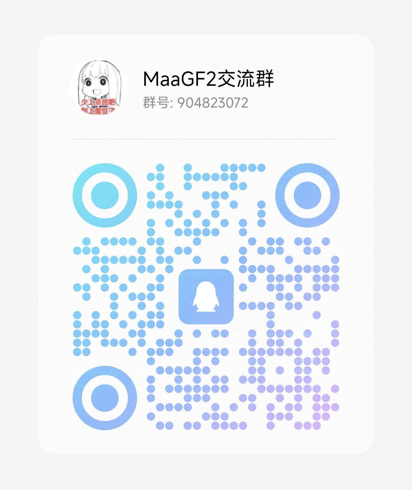

<!-- markdownlint-disable MD033 MD041 -->

# MaaGF2Exilium助手

本项目基于 [MaaFramework](https://github.com/MaaXYZ/MaaFramework) 所提供的项目模板进行开发的少女前线2：追放的自动化助手。

## 联系方式

如果有不懂的地方，抑或是想要添加的功能，或者你也想一起开发，甚至是划水聊天~~催更~~。

欢迎扫码加入**QQ交流群：904823072**。

## 使用前提
> 大部分测试都是在 Windows 系统上测试的，因此其他操作系统若有运行问题，请提 Issues 或加群讨论。
0. 默认用户的操作系统为 Windows 系统。
1. 推荐使用MuMu模拟器12运行游戏，[模拟器支持情况](https://maa.plus/docs/zh-cn/manual/device/windows.html)请查看官方文档。
2. 模拟器建议设置为`16:9`的比例的分辨率，该比例典型的分辨率有`3840*2160 (4K)`、`2560*1440 (2K)`、`1920*1080 (1080P)`、`1280*720 (720P)`。

## 使用方式

 0. 从 [Releases](https://github.com/DarkLingYun/MaaGF2Exilium/releases)下载压缩包名为 `MaaGF2ExiliumGUI-win-x86_64-v0.x.x.zip` 的GUI版本。
 1. 解压下载好的压缩包
 2. 双击或右键运行解压目录下的 `MaaGF2Exilium.exe` 文件即可 **(确保[MuMu模拟器](https://mumu.163.com/)已运行)**

 
 

  
   
  软件界面图

## 待开发功能
* [ ] 通用版本活动(大小型活动通用)
  * [ ] 物资模式自律
  * [ ] 物资商品兑换功能
* [ ] 商城易物所集中兑换
  * [ ] 兑换优先级
    * [ ] 优先兑换基原信息核
    * [ ] 优先兑换访问许可及专访许可
    * [ ] 优先兑换角色心智存档碎片
  * [ ] 商店类型
    * [ ] 班组商店
    * [ ] 公共区调度商店
    * [ ] 讯段交易(每周首领挑战)
    * [ ] 人形堆栈商店兑换
* [ ] 仓库
  * [ ] 开箱子
* [ ] 构建覆盖现有 `install` 目录
* [ ] GUI 迁移到 electron，支持跨平台（macos）
  
## 已有功能

* [x] 启动游戏

* [x] 日常任务前准备
  * [x] 领取情报体力(限时)
  * [x] 领取七日签到资源(限时)
  * [x] 领取邮件
  * [x] 领取活动页情报补给体力
  * [x] 使用完体力药水
  * [x] 商城购买每日免费补给箱
  * [x] 边界推进晶源采集派遣与领取
  * [ ] 仓库
    * [x] 拆解武器配件(支持选择拆解类型) *默认关闭*

* [x] 公共区日常
  * [x] 访问休息室
  * [x] 调度室任务一键领取和再次派遣
  * [x] 领取调度收益的情报储备和资源生产
  * [x] 派遣收益领取

* [x] 萨狄斯金_配件精调及心智螺旋

* [x] 定向精研
  * [x] 支持配件类型与配件效果选择
  * [x] 自动寻找最高可自律关卡(玩家需要确保每个配件类型下至少有一个可自律关卡) 

* [x] 补给作战
  * [x] 自动寻找最高可自律关卡(玩家需要确保至少有一个可自律关卡) 
  * [ ] 补给资源选择：
    * [x] 战争报告_人形升级
    * [x] 解析图纸_武器升级
    * [x] 增域存量条_提升人形等级上限

* [x] 心智勘测
  * [x] 材料选择
  * [x] 自动寻找最高可自律关卡

* [x] 模拟作战日常
  * [x] 常规首领挑战自律
    * [x] 支持自动自律
    * [ ] 讯段交易(这个真的要写吗。。。)
  * [x] 自动实兵演习
  * [x] 自动兵棋推演
    - 暂不支持自动领取推演奖励

* [ ] 班组日常
  * [x] 补给领取
  * [x] 要务自动战斗
  * ~~[ ] 尘烟前线自动作战~~
  * ~~[ ] 尘烟前线补给领取~~
  * ~~[ ] 班组商店自动购物~~
  * ~~[ ] 班组商店优先性选择~~

* [x] 领取奖励
  * [x] 每日委托奖励
  * [x] 巡录通行证奖励
    * [x] 沿途行动周期奖励(每日/每周任务奖励)
    * [x] 等级奖励领取
    * [x] 等级补给箱确认(付费通行证未测试)

* [ ] 暗香赠礼
  * [ ] 铁玫瑰和火玫瑰补给箱开启
  * [ ] 补给箱补给道具选择

* [x] 关闭游戏

## 开发相关
请参考[文档](docs/开发相关.md)

## 鸣谢

本项目由 **[MaaFramework](https://github.com/MaaXYZ/MaaFramework)** 强力驱动！

感谢以下开发者对本作出的贡献:

Made with [contrib.rocks](https://contrib.rocks)
