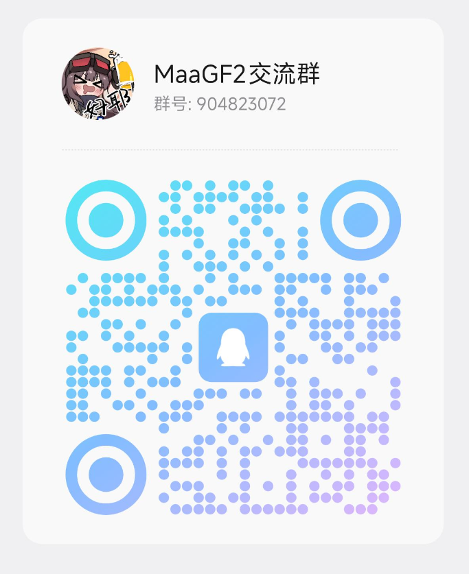
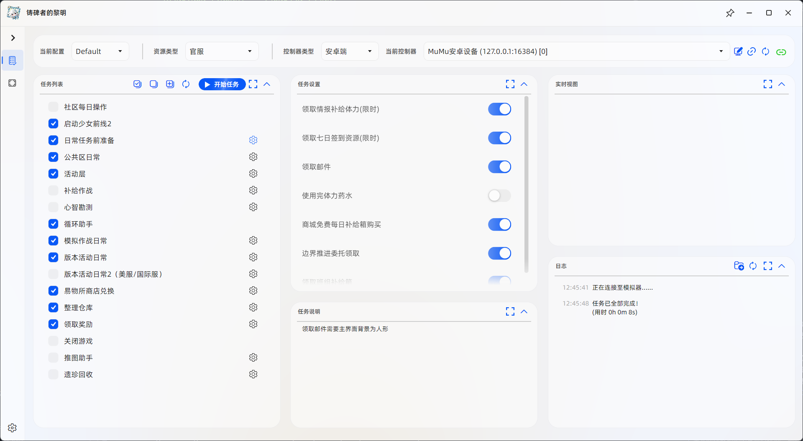
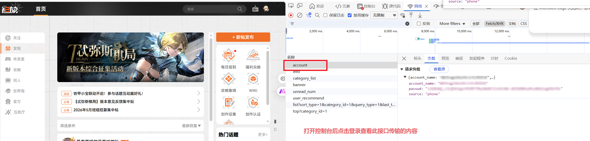
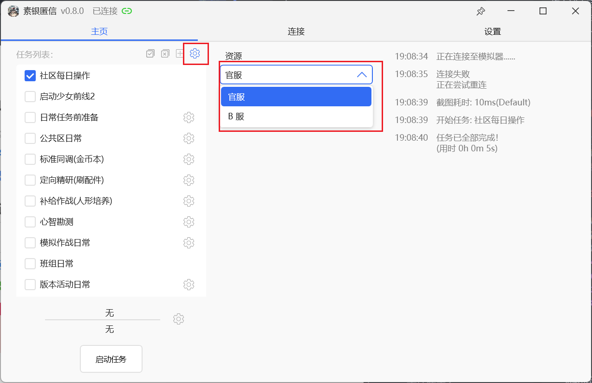

<!-- markdownlint-disable MD033 MD041 -->
<p align="center">

</p>

<div align="center">

# MaaGF2Exilium Assistant

</div>

> English translation of [`README.md`](README.md).

An automation assistant for **Girls' Frontline 2: Exilium**, built on the project template provided by [MaaFramework](https://github.com/MaaXYZ/MaaFramework).

## Contact

If something is unclear, you want a feature added, you'd like to help develop, or you just want to hang out ~~and nag for updates~~ — you're welcome to scan the QR code and join the **QQ group: 904823072**.

<p align="center">

</p>

## Things to know

> [!NOTE]
> Most testing is done on Windows, so if you hit problems on other operating systems, please open an Issue or discuss in the group.
> Development is tested on the MuMu 12 emulator, so MuMu 12 is recommended. If another emulator misbehaves, please save and screenshot `debug\maa.log` from the script's root directory and report it.

0. The default assumption is that you're on Windows.
1. MuMu Player 12 is recommended for running the game. See the [official docs on emulator support](https://maa.plus/docs/en-us/manual/device/windows.html).
2. Set the emulator to a `16:9` resolution. Typical 16:9 resolutions: `3840×2160 (4K)`, `2560×1440 (2K)`, `1920×1080 (1080p)`, `1280×720 (720p)`.
3. After updating in-app, newly added features may not show up. If so, close the program, delete `config.json` in the program's `config` directory, then reopen it. You'll need to reconfigure some options.

## How to use

0. Download the GUI release named `MaaGF2ExiliumGUI-win-x86_64-v0.x.x.zip` from [Releases](https://github.com/DarkLingYun/MaaGF2Exilium/releases).
1. Extract the archive.
2. Double-click (or right-click → run) `MaaGF2Exilium.exe` in the extracted folder. **(Make sure the [MuMu emulator](https://mumu.163.com/) is running.)**

<br>
 <p align="center">
  
  <br>
  <span>The software UI</span>
</p>

## Feature notes

> [!NOTE]
> Please read the feature notes carefully and be aware of the usage caveats. Features not described here have no special caveats by default. The full feature list is further down.

### Community daily operations

> [!NOTE]
> Before using this feature, make sure you can log in to the [GF2: Exilium community](https://gf2-bbs.exiliumgf.com/) with your account and password.

Once you've confirmed you can log in, create a file named `secret.json` in the program's `config` directory to use the `Community daily operations` feature. Open it with Notepad (or similar), paste the content below, and save. See the image for how to obtain the ciphertext:

<p align="center">
  
  <br>
  <span>How to obtain the ciphertext</span>
</p>

```json
{
  "account_name": "phone-number or email ciphertext",
  "passwd": "password ciphertext",
  "source": "phone"
}
```

Then enable the feature in the program.

#### Examples

Phone-number account:

```json
{
  "account_name": "15311112222",
  "passwd": "123456789"
}
```

Email account:

```json
{
  "account_name": "2760888888@qq.com",
  "passwd": "123456789"
}
```

### Bulk-using redeem codes on the profile page

Redeem codes are stored in a Gitee repo: [GuiLuan/GF2_RedeemCode](https://gitee.com/guiluan/GF2_RedeemCode). You can view the currently available codes on [this page](https://gitee.com/guiluan/GF2_RedeemCode/blob/master/redeemCode.json).

> [!CAUTION]
> Cloud codes are collected personally and submitted by users; not all of them are guaranteed to work.
>
> As of 2025/02/16 there are **no** usable codes in the repo.

When running this task, the script saves codes you've already used locally in `config/redeemCode.json` to avoid reusing them. For that reason, it's best not to delete this file when updating resources.

### Launching / closing the game

Because different distribution channels implement it differently, launching and closing the game requires manually setting the corresponding channel's resource first. Switch it as shown below:

<p align="center">

</p>

### Daily task preparation

Daily task preparation includes a "dismantle weapon attachments" feature with selectable dismantle grades. Unless you've set up attachment lock rules manually, selecting `Precision-grade and below (Untrained)` is not recommended. This feature is off by default, and the default dismantle grade is `Industrial-grade and below (Untrained)`.

### Exchange Shop redemption

> [!NOTE]
> Currently some shops only redeem rare items; other non-rare items are not redeemed by default. Custom selection may be added later.

Redemption details:

#### Squad shop

> [!NOTE]
> Only the reputation shop is supported.

1. PPSh mind archive
2. Fire control calibration chip

#### Dispatch shop

1. Access permit
2. Gift box
3. Reserve bar T2
4. Reserve bar T3
5. Reserve bar T4
6. Battlefield report
7. Sardis gold
8. Analysis blueprint
9. Memory Selection · Undercurrent
10. Memory Selection · Frontline

#### Signal Segment trade (weekly boss challenge)

1. Sabrina mind archive
2. Access permit
3. Base info core
4. Next-gen memory bar

### Squad dailies

#### Dust Front

> [!WARNING]
> The default battle type is Outpost mode. You can switch to Assault, but the Assault logic currently tends to score low, so it's recommended to manually pick Outpost or turn this feature off and wait for a future upgrade.

The current logic: pick a prep-room loadout, then select the first four dolls by combat effectiveness, then open the support list and pick from the first row of 3 dolls in order until one successfully joins. If all three dolls in the support row are already deployed, it defaults to fighting with four dolls.

After a battle, when it detects there aren't enough battle attempts left, it will claim any claimable rewards it finds.

## FAQ

See the [docs](docs/en/FAQ.md).

## Existing features

* [x] Community daily operations *(off by default)*
* [x] Launch the game
* [x] Auto-use redeem codes on the profile page (pulled from the cloud, no user input needed) *(off by default)*
* [x] Daily task preparation
  * [x] Claim intel stamina (limited-time)
  * [x] Claim 7-day check-in resources (limited-time)
  * [x] Claim mail
  * [x] Claim event-page intel-supply stamina
  * [x] Use up stamina potions
  * [x] Buy free supply boxes in the shop (weekly and daily boxes)
  * [x] Boundary-advance crystal-source dispatch and claiming
* [x] Public-area dailies
  * [x] Visit the lounge
  * [x] One-click claim and re-dispatch of dispatch-room tasks
  * [x] Claim dispatch earnings (intel reserves and resource production)
  * [x] Claim dispatch payouts
* [x] Activity floor
  * [x] Delicious cooking
  * [x] Tea break
  * [x] Claim Leisure-Calc progress rewards
* [x] Sardis-gold attachment fine-tuning and mind spiral
* [x] Targeted research
  * [x] Supports attachment-type and attachment-effect selection
  * [x] Auto-find the highest auto-clearable stage (you must ensure each attachment type has at least one auto-clearable stage)
* [x] Supply operations
  * [x] Auto-find the highest auto-clearable stage (you must ensure at least one auto-clearable stage exists)
  * [ ] Supply-resource selection:
    * [x] Battle report — doll level-up
    * [x] Analysis blueprint — weapon upgrade
    * [x] Domain reserve bar — raise doll level cap
* [x] Mind survey
  * [x] Material selection
  * [x] Auto-find the highest auto-clearable stage
* [x] Simulated-combat dailies
  * [x] Regular boss-challenge auto-battle
    * [x] Supports full auto
  * [x] Auto live drill
  * [x] Auto-claim peak-estimation regular rewards
  * [x] Auto-run Lv.0 extreme peak
  * [x] Fully auto wargame (stops after claiming all participation rewards)
* [x] Squad dailies
  * [x] Claim supplies
  * [x] Auto-battle key missions
  * [x] Dust Front auto-battle
  * [x] Dust Front supply claiming
* [x] Generic version events (works for both large and small events)
  * [x] Supply-mode auto-clear
  * [x] Supply-goods exchange
* [x] Exchange Shop bulk redemption
  * [x] Squad shop
  * [x] Public-area dispatch shop
  * [x] Signal Segment trade (weekly boss challenge)
* [x] Organize warehouse
  * [x] Dismantle weapons (with type selection)
  * [x] Dismantle weapon attachments (with type selection)
  * [x] Dismantle growth data (with type selection)
  * [x] Open supply-boost boxes
* [x] Claim rewards
  * [x] Commission rewards (daily orders, perilous-path witness, journey monument)
  * [x] Voyage pass rewards
    * [x] Along-the-way periodic rewards (daily/weekly task rewards)
    * [x] Level-reward claiming
    * [x] Level supply-box confirmation
  * [x] Profile-page support rewards
  * [x] Peril excavation (limited-time)
  * [x] Preview
  * [x] Dark-fragrance gift
  * [x] Aimo wishing pool
  * [x] Simulation practice
  * [x] Greenmeow's commission
  * [x] 7-day check-in limited 10-pull
  * [x] Limited-time medium-event tasks
* [x] Close the game

## Planned features

Before you start development, please declare what you intend to work on [here](https://github.com/DarkLingYun/MaaGF2Exilium/issues/37) and check whether someone is already doing the same thing.

* [ ] Dust Front doll-selection logic upgrade (on hold)

## Development

See the [docs](docs/en/Development.md).

## Acknowledgements

This project is powered by **[MaaFramework](https://github.com/MaaXYZ/MaaFramework)**!

Thanks to the following developers for their contributions:

<a href="https://github.com/DarkLingYun/MaaGF2Exilium/graphs/contributors">
  
</a>

Made with [contrib.rocks](https://contrib.rocks)
