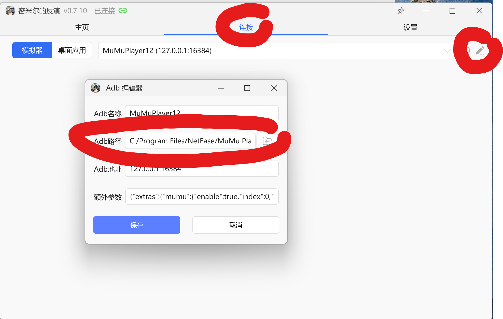
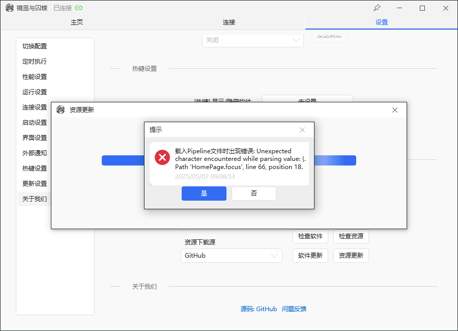

# FAQ

> English translation of [`docs/常见问题.md`](../常见问题.md).

## "Failed to load resource"

Delete the whole folder, download the latest release archive again, and re-run it.

~~Reinstalling solves 99% of problems.~~

## Can't delete a folder — it's in use

Open Task Manager, search for `adb.exe`, and end the process.

## Error when connecting to the emulator

Go to the **Connection** tab in the top row and click the pencil-like icon to open the ADB editor.

In your emulator's install directory, find the `adb.exe` file and select it as the ADB path.

(See the screenshot below.)



If it still doesn't work, try:

1. Close the emulator and MAA.
2. In Task Manager, find `adb.exe` and end the process.
3. Try again.

## Does it support the PC client?

No. Only emulators are supported. The PC client is untested and it fights you for control of the mouse.

## Error when loading a Pipeline file: `Unexpected character`

For an error like the one below:



Go to **Settings → Update Settings** and click the **Software Update** button.

## Does it support macOS?

The recommended emulator is [BlueStacks Air](https://www.bluestacks.com/mac); enable ADB debugging in its settings.

Download the macOS version that uses the new GUI here: https://github.com/chesha1/MaaGF2Exilium/releases

You need the .NET Runtime installed before running. There are two ways to get it:

**Option 1: Install with Homebrew (recommended)**

```bash
brew install --cask dotnet-runtime
```

**Option 2: Install manually**

Go to the [.NET official download page](https://dotnet.microsoft.com/en-us/download/dotnet/10.0/runtime), download the .NET Runtime installer for macOS, and follow the prompts.

After installing, run `./MaaGF2Exilium` to start the program.
