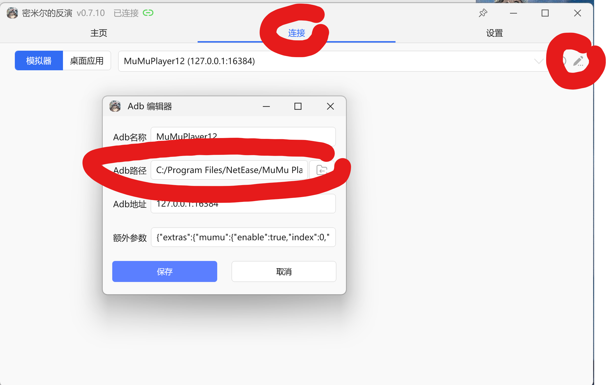
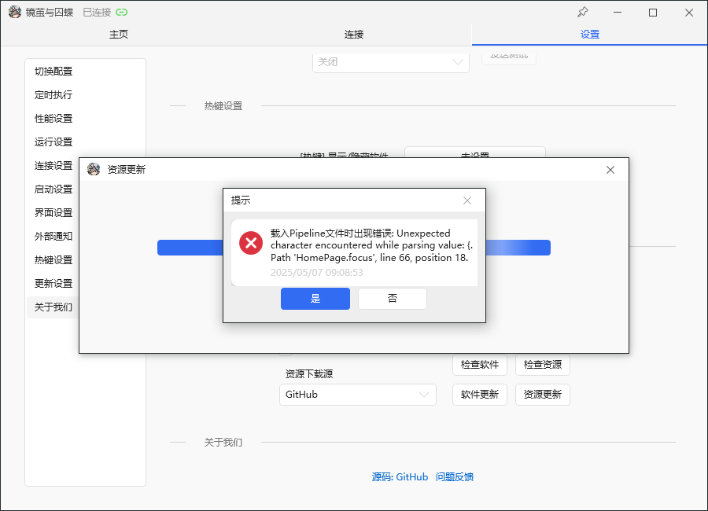

# 常见问题
## 加载资源失败
删掉整个文件，重新下载新的版本软件的压缩包，重新使用

~~重装解决99%的问题~~

## 无法删除文件夹，被占用了
打开任务管理器，搜索 `adb.exe` 结束进程

## 连接模拟器时发生错误
到最上面一行的“连接”界面，点击长得像笔的那个图标，打开 Adb 编辑器界面

到你所用的模拟器安装路径下，找到 `adb.exe` 这个文件，在 Adb 路径这里选择这个文件

类似下图



如果还不行，可以试着：

1. 关闭模拟器和 maa
2. 到任务管理器中查找 `adb.exe`，结束进程
3. 再试一次

## 支持 pc 端吗？
不支持，只能用模拟器，pc 端没测试过，而且会抢鼠标

## 裁入Pipeline文件时出现错误：Unexpected character
类似下图的报错



在设置-更新设置中，点击“软件更新”按钮

## 支持 macos 吗？

推荐使用 [BlueStacks Air](https://www.bluestacks.com/mac) 模拟器，在设置中打开 adb 调试

到这里下载使用新 GUI 的 macos 版本：https://github.com/chesha1/MaaGF2Exilium/releases

运行前需要安装 .NET Runtime，有以下两种方式：

**方式一：使用 Homebrew 安装（推荐）**

```bash
brew install --cask dotnet-runtime
```

**方式二：手动安装**

前往 [.NET 官方下载页面](https://dotnet.microsoft.com/zh-cn/download/dotnet/10.0/runtime) 下载适用于 macOS 的 .NET Runtime 安装包，按照提示完成安装。

安装完成后，运行 `./MaaGF2Exilium` 启动程序
